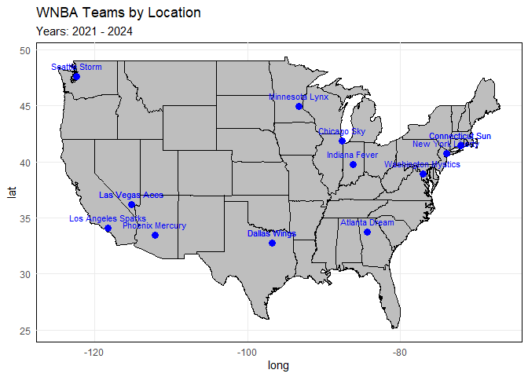
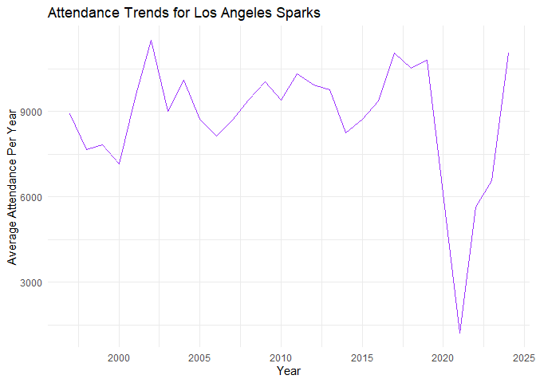

<!-- README.md is generated from README.Rmd. Please edit that file -->

# wnbaherstory 

<!-- badges: start -->

[](https://github.com/sds270-f24/wnbaherstory/actions/workflows/R-CMD-check.yaml)

[](https://CRAN.R-project.org/package=wnbaherstory)

<!-- badges: end -->

## Overview

wnbaherstory is an R package that provides historical data on the WNBA
(Women’s National Basketball Association). The WNBA was founded in 1997
and since then has had a lot of changes from team re-locations to
ownership changes to different players going in and out of the league.
This package has data on team win rate, attendance, team location, and
the top high scorers. All of this data is historical and can be traced
from the beginning of the WNBA (1997) to the present. User can have the
option to view historical data of all time, or user can put in
parameters in each function to specify what years, players, or teams
they want to specifically look at. We hope this package can not only
answer historical questions about the WNBA but also allow for users to
see how the league has changed and grown over time.

## Installation

You can install the development version of wnbaherstory from
[GitHub](https://github.com/) with:

``` r
# install.packages("devtools")
devtools::install_packages("sds270-f24/wnbaherstory")
```

## Load

``` r
library(wnbaherstory)
```

## Examples:

``` r
library(wnbaherstory)

winRate("Seattle Storm")
```

    ## [1] 52.60664

``` r
map_WNBA_teams(year_range = 2021:2024)
```

<!-- -->

``` r
plot_wnba_attendance("Los Angeles Sparks")
```

<!-- -->

## Example: High Scorers of All Time

``` r
career_ppg()
# Add player names for specific players
# Interactive Plot
```


## Contributors

- [Jane Loo](https://github.com/janeloo10)
- [Ella Sylvester](https://github.com/esylvester04)
- [Alina Abdulina](https://github.com/AlinaAbdulina)
